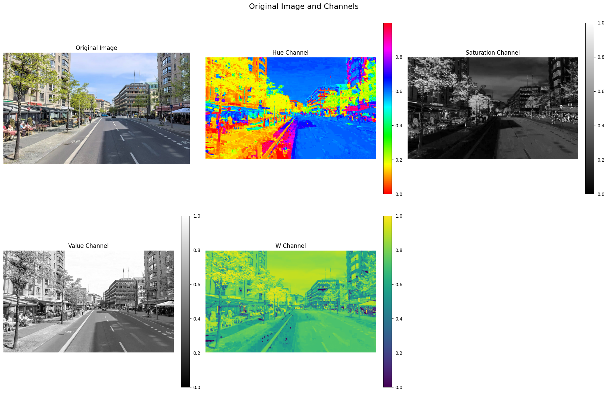
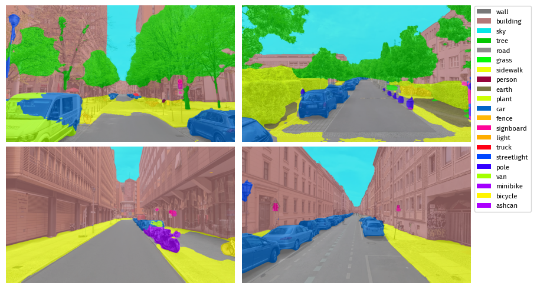

# From Perception to Appraisal: Hierarchical Responses to Natural and Built Features in Urban Environments (Zaehme et al., 2025) -- Analysis Scripts

<div style="text-align:center;">
   
   
</div>

This repository contains the analysis pipeline used in the publication "From Perception to Appraisal: Hierarchical Responses to Natural and Built Features in Urban Environments" for investigating neural correlates of urban environment perception using EEG event-related potentials (ERPs), low-level visual features, and subjective ratings.

## Overview

This project contains scripts for:
- **Preprocessing EEG data**: Preprocessing pipeline (using BeMoBIL pipeline) plus extraction of Event-related potentials (P1, N1, P300, LPP)
- **Extracting Visual features of Urban Scenes**: Low-level features and semantic segmentation
- **Statistical analysis**: Linear mixed-effects models (LMMs) examining relationships between neural, visual, and subjective measures

## Repository Structure

```
perception2appraisal_analyses/
├── README.md                           
│
├── data/                               # Processed data files
│   ├── AverageP3_LPP.csv              # Pre-extracted average P3 and LPP amplitudes
│   ├── final_sociodem.xlsx            # Sociodemographic data
│   ├── segmentation_pixel_sums_incl.csv  # Semantic segmentation results
│   ├── subjective_ratings.zip         # Participant ratings
│   └── peaks/                         # Per-stimulus ERP peak amplitudes by electrode  
│
├── EEG_preprocessing/                 # MATLAB preprocessing pipeline for EEG data
│   ├── bemobil_pipeline.m             # Core BeMoBIL preprocessing
│   ├── EEG_Preprocessing_Zaehmeetal.m # Main preprocessing script
│   ├── README.md                      # Detailed preprocessing documentation
│   ├── config/                        # Configuration files
│   │   ├── eventsStimScale.mat        # Event Names
│   │   └── ua_config.m                # BeMoBIL pipeline config file
│   └── functions/                     # Custom MATLAB functions
│       ├── eeglab_parse_key_val.m     
│       ├── exportERPs.m
│       ├── extractAndSaveAverages.m
│       └── extractAndSavePeaks.m
│
├── image_feature_extraction/          # Visual feature extraction (Python)
│   ├── low_level_features_berman.ipynb # Low-level visual feature extraction
│   ├── depth.ipynb                    # Depth estimation analysis
│   ├── segmentation.ipynb             # Semantic segmentation notebook
│   ├── segmentation_ade.py            # SegFormer ADE20K inference script
│   ├── utils.py                       # Shared utility functions
│   └── requirements.txt               # Python dependencies
│
└── statistical_analyses/               # R statistical analysis scripts
    ├── 01_data_preparation.R          # Data merging and cleaning
    ├── 02_lme_semseg_llvf.R          # LMMs for ratings ~ visual features
    ├── 03_lme_erp_subj.R             # LMMs for ratings~erp relationships
    └── prepared_data/
        ├── data_LMMs_erps_subj.csv   # Merged analysis-ready dataset
        └──
```

## Getting Started

### Prerequisites

#### For Python Analysis (Visual Features)
- Python 3.13.3 (see `requirements.txt` for all dependencies)
- Key packages: PyTorch, torchvision, transformers, scikit-image, pandas, numpy

#### For MATLAB Preprocessing (EEG)
- MATLAB (R2019b or later)
- [EEGLAB](https://sccn.ucsd.edu/eeglab/) toolbox
- [BeMoBIL Pipeline](https://github.com/BeMoBIL/bemobil-pipeline)

#### For R Statistical Analysis
- R (4.0 or later)
- Packages: dplyr, readr, readxl, tidyr, lme4, lmerTest

#### Data
- Raw EEG data in BIDS format can be downloaded from the corresponding [OpenNeuro repository](https://doi.org/10.18112/openneuro.ds006850.v1.0.0). Analysis-ready datasets are included in the repository under 'statistical_analyses/prepared_data/'

### Installation

1. **Clone the repository:**
   ```bash
   git clone https://github.com/BeMoBIL/neurourbanism.git
   cd neurourbanism
   ```

2. **Set up Python environment:**
   ```bash
   # Create virtual environment (optional but recommended)
   python -m venv venv
   source venv/bin/activate  # On Windows: venv\Scripts\activate
   
   # Install dependencies
   pip install -r requirements.txt
   ```

3. **Set up MATLAB environment:**
   - Install EEGLAB and BeMoBIL Pipeline
   - Update paths in `EEG_preprocessing/config/ua_config.m`
   - See `EEG_preprocessing/README.md` for detailed instructions

4. **Set up R environment:**
   ```r
   # Install required packages
   install.packages(c("dplyr", "readr", "readxl", "tidyr", "lme4", "lmerTest"))
   ```

## Workflow

### 1. EEG Preprocessing (MATLAB)
The raw EEG data (BIDS format, available on OpenNeuro: ds006850) is preprocessed using the BeMoBIL pipeline:

**Output:** ERP peak amplitudes extracted to `data/peaks/*.csv`

See `EEG_preprocessing/README.md` for detailed preprocessing steps.

### 2. Visual Feature Extraction (Python)

#### Low-Level Visual Features
Extract edge density, contrast, brightness, and other low-level features:
```python
# Run low_level_features_berman.ipynb
jupyter notebook low_level_features_berman.ipynb
```

#### Depth Estimation
Estimate depth maps from urban scene images:
```python
# Run depth.ipynb
jupyter notebook depth.ipynb
```

#### Semantic Segmentation
Extract semantic image contents using the SegFormer-B5 model pretrained on the ADE20K dataset.
```python
jupyter notebook segmentation.ipynb
```

**Output:** Visual feature matrices ready for statistical analysis (also included pre-calculated in 'statistical_analyses/prepared_data/')

### 3. Data Integration and Statistical Analysis (R)

#### Step 1: Prepare combined dataset
```r
source("statistical_analyses/01_data_preparation.R")
```
Merges ERP peaks, subjective ratings, sociodemographics, and segmentation data.

#### Step 2: Analyze visual features
```r
source("statistical_analyses/02_lme_semseg_llvf.R")
```
Linear mixed-effects models examining relationships between semantic segmentation/low-level features and ERPs.

#### Step 3: Analyze ERP-subjective relationships
```r
source("statistical_analyses/03_lme_erp_subj.R")
```
Linear mixed-effects models examining relationships between ERPs and subjective ratings.

## Data Description

### EEG Data
See [OpenNeuro repository](https://doi.org/10.18112/openneuro.ds006850.v1.0.0) for detailed description of dataset.

### Subjective Ratings
Participants rated urban scenes on 9 dimensions (Likert scales):
- SAM Arousal
- SAM Valence
- SAM Dominance
- Beauty (Schönheit)
- Fascination (Faszination)
- Hominess (Heimeligkeit)
- Openness (Offenheit)
- Safety (Sicherheit)
- Stress


## Citation

This code accompanies the paper:

> Zähme et al. (2025). From Perception to Appraisal: Hierarchical Brain Responses to Natural and Built Features in Urban Environments. *Under Review*.

If you use this code, please cite the paper once published. Preprint: [https://doi.org/10.1101/2025.10.31.685763](https://doi.org/10.1101/2025.10.31.685763) 

## Related Resources

- **Raw EEG Data**: [OpenNeuro repository](https://doi.org/10.18112/openneuro.ds006850.v1.0.0)
- **BeMoBIL Pipeline**: https://github.com/BeMoBIL/bemobil-pipeline
- **EEGLAB**: https://sccn.ucsd.edu/eeglab/
- **Segmentation Model**: https://huggingface.co/nvidia/segformer-b5-finetuned-ade-640-640
- **Depth Estimation Model**: https://github.com/DepthAnything/Depth-Anything-V2 
- **Chronicity Estimation**: [Vadivel et al., 2008](https://dx.doi.org/10.1504/IJSISE.2008.026796)


## Contact

For questions or issues, please contact the repository maintainers.

---

**Last updated:** November 2025  
